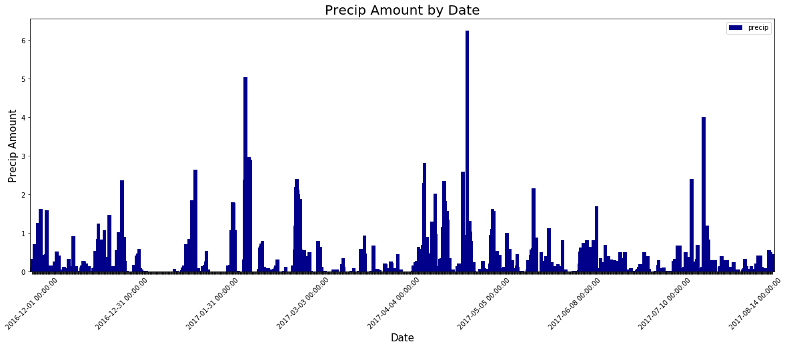
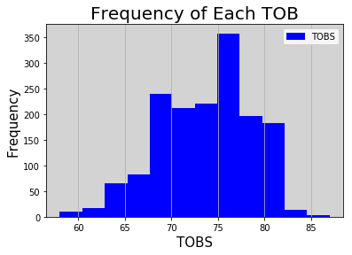
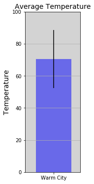

### Dependents
***


```python
from matplotlib import dates
from datetime import datetime
import matplotlib.dates as mdates
import matplotlib.ticker as ticker
import seaborn as sns
import numpy as np
import matplotlib.pyplot as plt
import pandas as pd
import sqlalchemy
from sqlalchemy import asc, and_
from sqlalchemy.ext.automap import automap_base
from sqlalchemy.orm import Session
from sqlalchemy import create_engine, inspect, func
import matplotlib.patches as mpatches
from flask import Flask, jsonify
```

### Ensure data loads
***


```python
engine = create_engine("sqlite:///hawaii.sqlite", echo=False)
```


```python
# Ensuring tables are present
inspector = inspect(engine)
inspector.get_table_names()
```


    ['measure', 'stations']


```python
# Looking at the columns of the Measure table
columns = inspector.get_columns('measure')
for c in columns:
    print(c['name'], c["type"])
```

    id INTEGER
    station VARCHAR
    precip FLOAT
    tobs INTEGER
    date DATETIME


```python
# Looking at the colums of the Stations table
columns = inspector.get_columns('stations')
for c in columns:
    print(c['name'], c["type"])
```

    id INTEGER
    station VARCHAR
    latitude FLOAT
    longitude FLOAT
    elevation FLOAT
    name VARCHAR
    country VARCHAR
    state VARCHAR


```python
# Executing a select to ensure good connection to the database
engine.execute('SELECT * FROM measure LIMIT 5').fetchall()
```


    [(1, 'USC00519397', 0.08, 65, '2010-01-01 00:00:00.000000'),
     (2, 'USC00519397', 0.0, 63, '2010-01-02 00:00:00.000000'),
     (3, 'USC00519397', 0.0, 74, '2010-01-03 00:00:00.000000'),
     (4, 'USC00519397', 0.0, 76, '2010-01-04 00:00:00.000000'),
     (5, 'USC00519397', 0.0, 73, '2010-01-06 00:00:00.000000')]


```python
engine.execute('SELECT * FROM stations LIMIT 5').fetchall()
```


    [(1, 'USC00519397', 21.2716, -157.8168, 3.0, 'WAIKIKI 717.2', 'US', 'HI'),
     (2, 'USC00513117', 21.4234, -157.8015, 14.6, 'KANEOHE 838.1', 'US', 'HI'),
     (3, 'USC00514830', 21.5213, -157.8374, 7.0, 'KUALOA RANCH HEADQUARTERS 886.9', 'US', 'HI'),
     (4, 'USC00517948', 21.3934, -157.9751, 11.9, 'PEARL CITY', 'US', 'HI'),
     (5, 'USC00518838', 21.4992, -158.0111, 306.6, 'UPPER WAHIAWA 874.3', 'US', 'HI')]


### Database Queries to Answer Question and to Plot
***


```python
Base = automap_base()
Base.prepare(engine, reflect=True)
Measure = Base.classes.measure
```


```python
session = Session(engine)
```


```python
session.query(func.sum(Measure.precip)).all()
```


    [(2908.1299999999706)]


```python
# Querying the database for records over the past 12 months
date_precip = session.query(Measure.date, Measure.precip).\
    filter(Measure.date > '2016-12-01').\
    order_by(Measure.date).all()
```


```python
# Creating a dataframe with the results of the SELECT statement
date_precip_df = pd.DataFrame(date_precip)
```


```python
# Setting the index to DATE
date_precip_df = date_precip_df.set_index('date')
```


```python
date_precip_df.head()
```


<div>
<style>
    .dataframe thead tr:only-child th {
        text-align: right;
    }

    .dataframe thead th {
        text-align: left;
    }

    .dataframe tbody tr th {
        vertical-align: top;
    }
</style>
<table border="1" class="dataframe">
  <thead>
    <tr style="text-align: right;">
      <th></th>
      <th>precip</th>
    </tr>
    <tr>
      <th>date</th>
      <th></th>
    </tr>
  </thead>
  <tbody>
    <tr>
      <th>2016-12-01</th>
      <td>0.12</td>
    </tr>
    <tr>
      <th>2016-12-01</th>
      <td>0.33</td>
    </tr>
    <tr>
      <th>2016-12-01</th>
      <td>0.07</td>
    </tr>
    <tr>
      <th>2016-12-01</th>
      <td>0.00</td>
    </tr>
    <tr>
      <th>2016-12-01</th>
      <td>0.16</td>
    </tr>
  </tbody>
</table>
</div>


```python
# Saving the indexes as labels or xticks
date_precip_index = date_precip_df.index
```


```python
date_precip_index
```


    DatetimeIndex(['2016-12-01', '2016-12-01', '2016-12-01', '2016-12-01',
                   '2016-12-01', '2016-12-01', '2016-12-01', '2016-12-02',
                   '2016-12-02', '2016-12-02',
                   ...
                   '2017-08-21', '2017-08-21', '2017-08-21', '2017-08-22',
                   '2017-08-22', '2017-08-22', '2017-08-23', '2017-08-23',
                   '2017-08-23', '2017-08-23'],
                  dtype='datetime64[ns]', name='date', length=1597, freq=None)


```python
# Generating a plot of all 1500 date/precipation records
# Given the number of xtick labels, I found a nice function to declutter the plot
fig, ax = plt.subplots(figsize=(20,7))
date_precip_df.plot(kind='bar', y='precip', ax=ax, width=8, color='darkblue')
plt.title('Precip Amount by Date', size=20)
plt.xlabel('Date', size=15)
plt.ylabel('Precip Amount', size=15)
plt.xticks(rotation=45)
#ax = plt.gca()
#ax.set_facecolor('white')
#plt.grid(True, axis='x')
n = 195
[l.set_visible(False) for (i,l) in enumerate(ax.xaxis.get_ticklabels()) if i % n != 0]
plt.show()
```





### Database Queries to Answer Questions
***


```python
# Station name and the number of observations by station - ordered by station name
stat_count = session.query(Measure.station, func.count(Measure.station)).group_by(Measure.station)
for count in stat_count:
    print(count)
```

    ('USC00511918', 1979)
    ('USC00513117', 2709)
    ('USC00514830', 2202)
    ('USC00516128', 2612)
    ('USC00517948', 1372)
    ('USC00518838', 511)
    ('USC00519281', 2772)
    ('USC00519397', 2724)
    ('USC00519523', 2669)


```python
# Printing the stations and observation counts - descending order
# Printing the station with the most observations
highest_count=0
stat_count = session.query(Measure.station, func.count(Measure.station))\
.group_by(Measure.station)\
.order_by(func.count(Measure.station).asc())
for station, count in stat_count:
    print(station, count)
    if count > highest_count:
        highest_count = count
        high_stat_name = station

print('The station with the highest number of observations is', high_stat_name, 'with a count of',highest_count, '.')
```

    USC00518838 511
    USC00517948 1372
    USC00511918 1979
    USC00514830 2202
    USC00516128 2612
    USC00519523 2669
    USC00513117 2709
    USC00519397 2724
    USC00519281 2772
    The station with the highest number of observations is USC00519281 with a count of 2772 .


```python
# Switching to the stations table
Base = automap_base()
Base.prepare(engine, reflect=True)
Station = Base.classes.stations
```


```python
session = Session(engine)
```


```python
# Total number of stations
session.query(func.count(Station.station)).all()
```


    [(9)]


### Producing a histogram
***


```python
date_tobs = session.query(Measure.date, Measure.tobs).\
    filter(Measure.date > '2016-12-01').\
    order_by(Measure.date).all()
```


```python
date_tobs_df = pd.DataFrame(date_tobs)
```


```python
date_tobs_df.head()
```


<div>
<style>
    .dataframe thead tr:only-child th {
        text-align: right;
    }

    .dataframe thead th {
        text-align: left;
    }

    .dataframe tbody tr th {
        vertical-align: top;
    }
</style>
<table border="1" class="dataframe">
  <thead>
    <tr style="text-align: right;">
      <th></th>
      <th>date</th>
      <th>tobs</th>
    </tr>
  </thead>
  <tbody>
    <tr>
      <th>0</th>
      <td>2016-12-01</td>
      <td>75</td>
    </tr>
    <tr>
      <th>1</th>
      <td>2016-12-01</td>
      <td>73</td>
    </tr>
    <tr>
      <th>2</th>
      <td>2016-12-01</td>
      <td>75</td>
    </tr>
    <tr>
      <th>3</th>
      <td>2016-12-01</td>
      <td>72</td>
    </tr>
    <tr>
      <th>4</th>
      <td>2016-12-01</td>
      <td>76</td>
    </tr>
  </tbody>
</table>
</div>


```python
date_tobs_df.dtypes
```


    date    datetime64[ns]
    tobs             int64
    dtype: object


```python
plt.hist(date_tobs_df['tobs'], bins=12, color='blue')
plt.title('Frequency of Each TOB', size=20)
plt.xlabel('TOBS', size=15)
plt.ylabel('Frequency', size=15)
plt_patch = mpatches.Patch(color='blue', label='TOBS')
ax = plt.gca()
ax.set_facecolor('lightgray')
plt.grid(True, axis='x')
plt.legend(handles=[plt_patch])
plt.show()
```





### Creating a function to calculate min, max and mean TOBs
***


```python
# Vacation dates
vac_dates = ['2016-12-01', '2016-12-02', '2016-12-03', '2016-12-04', '2016-12-05', '2016-12-06',\
            '2016-12-07','2016-12-08','2016-12-09','2016-12-10','2016-12-11','2016-12-12','2016-12-13',\
            '2016-12-14','2016-12-15','2016-12-16','2016-12-17','2016-12-18','2016-12-19','2016-12-20']
```


```python
# Calculation function with 2 inputs
def calc_temps(start_date, end_date):
    date_tobs = session.query(Measure.date, Measure.tobs).\
    filter(and_(Measure.date >= start_date, Measure.date <= end_date)).all()
    date_tobs_df = pd.DataFrame(date_tobs)
    min_tob = date_tobs_df['tobs'].min()
    max_tob = date_tobs_df['tobs'].max()
    mean_tob = date_tobs_df['tobs'].mean()
    return min_tob, max_tob, mean_tob
```


```python
# Unpacking the functions output into 3 variables
c_min, c_max, c_mean = calc_temps(vac_dates[0], vac_dates[-1])
```


```python
print('The minimun TOB is ',c_min)
print('The maximum TOB is ',c_max)
print('The average TOB is ',c_mean)
```

    The minimun TOB is  60
    The maximum TOB is  78
    The average TOB is  70.47154471544715


### Plotting the min, max, mean and errorbar of temperature data
***


```python
city = ["Warm City"]
avg_temp = [c_mean]
x_axis = np.arange(len(avg_temp))
delta_temp = c_max - c_min
```


```python
plt.figure(figsize = (2, 6))
plt.bar(x_axis, avg_temp, yerr = delta_temp, color="blue", alpha = 0.5, align="edge") 
tick_locations = [value+0.4 for value in x_axis]
plt.xticks(tick_locations, city)
plt.xlim(-0.25, len(x_axis))
plt.ylim(0, 100, 5)
ax = plt.gca()
ax.set_facecolor('lightgray')
plt.grid(True, axis='y')
plt.ylabel('Temperature', fontsize = 14)
plt.title('Average Temperature', fontsize = 14)
plt.show()
```





### Combining Flask and previous work to create an API
***


```python
# Database Setup
engine = create_engine("sqlite:///hawaii.sqlite", echo=False)
```


```python
# Reflect an existing database into a new model
Base = automap_base()
```


```python
# Reflect the tables
Base.prepare(engine, reflect=True)
```


```python
# Save reference to the table
Measure = Base.classes.measure
Station = Base.classes.stations
```


```python
# Create our session (link) from Python to the DB
session = Session(engine)
```


```python
# Flask Setup
app = Flask(__name__)
```


```python
# Flask Routes
start_date='2017-02-01'
end_date='2018-02-01'

@app.route("/")
def welcome1():
    """List all available api routes."""
    return (
        f"Available Routes:<br/>"
        f"/api/v1.1/precipitation<br/>"
        f"/api/v1.1/stations<br/>"
        f"/api/v1.1/tobs<br>"
        f"/api/v1.1/<start_date> & /api/v1.1/<end_date>")


@app.route("/api/v1.1/precipitation")
def date_tob():
	"""Return a list of all dates and temps from last year"""
	# Query all dates and temps
	results = session.query(Measure.date, Measure.tobs).filter(Measure.date > '2017-02-01').order_by(Measure.date).all()
	# Convert list of tuples into normal list
	data = list(np.ravel(results))

	return jsonify(data)

@app.route("/api/v1.1/stations")
def station():
    """Return a list of all stations"""
    # Query all stations
    results = session.query(Station.station).all()

    return jsonify(results)

@app.route("/api/v1.1/tobs")
def temp():
    """Return a list of all dates and temps from last year"""
    # Query all temps
    results = session.query(Measure.tobs).\
    filter(Measure.date > '2017-02-01').\
    order_by(Measure.date).all()

    # Convert list of tuples into normal list
    data = list(np.ravel(results))

    return jsonify(data)

@app.route("/api/v1.1/<start_date> and /api/v1.1/<end_date>")
def temp_tob():
    """Return a list of all dates and temps from last year"""
    # Query all dates and temps
    results_start_end = session.query(Measure.date, Measure.tobs).\
    filter(and_(Measure.date >= start_date, Measure.date <= end_date)).all()
    results_start_end_df = pd.DataFrame(results_start_end)
    
    range_min_tob = results_start_end_df['tobs'].min()
    range_max_tob = results_start_end_df['tobs'].max()
    range_mean_tob = results_start_end_df['tobs'].mean()

    results_start = results_start_end[results_start_end['date'] == start_date]
    results_end = results_start_end[results_start_end['date'] == end_date]
    
    results_start_min = results_start['tobs'].min()
    results_start_max = results_start['tobs'].max()
    results_start_mean = results_start['tobs'].mean()
    
    results_end_min = results_start['tobs'].min()
    results_end_max = results_start['tobs'].max()
    results_end_mean = results_start['tobs'].mean()

    return jsonify(results_start_min, results_start_max, results_start_mean,\
                  results_end_min, results_end_max, results_end_mean,\
                  range_min_tob, range_max_tob, range_mean_tob)

if __name__ == '__main__':
    app.run(debug=True)
```


    ---------------------------------------------------------------------------

    OSError                                   Traceback (most recent call last)

    <ipython-input-99-f134ebabf686> in <module>()
         68 
         69 if __name__ == '__main__':
    ---> 70     app.run(debug=True)
    

    ~/anaconda3/lib/python3.6/site-packages/flask/app.py in run(self, host, port, debug, **options)
        839         options.setdefault('use_debugger', self.debug)
        840         try:
    --> 841             run_simple(host, port, self, **options)
        842         finally:
        843             # reset the first request information if the development server


    ~/anaconda3/lib/python3.6/site-packages/werkzeug/serving.py in run_simple(hostname, port, application, use_reloader, use_debugger, use_evalex, extra_files, reloader_interval, reloader_type, threaded, processes, request_handler, static_files, passthrough_errors, ssl_context)
        718             s = socket.socket(address_family, socket.SOCK_STREAM)
        719             s.setsockopt(socket.SOL_SOCKET, socket.SO_REUSEADDR, 1)
    --> 720             s.bind((hostname, port))
        721             if hasattr(s, 'set_inheritable'):
        722                 s.set_inheritable(True)


    OSError: [Errno 48] Address already in use

